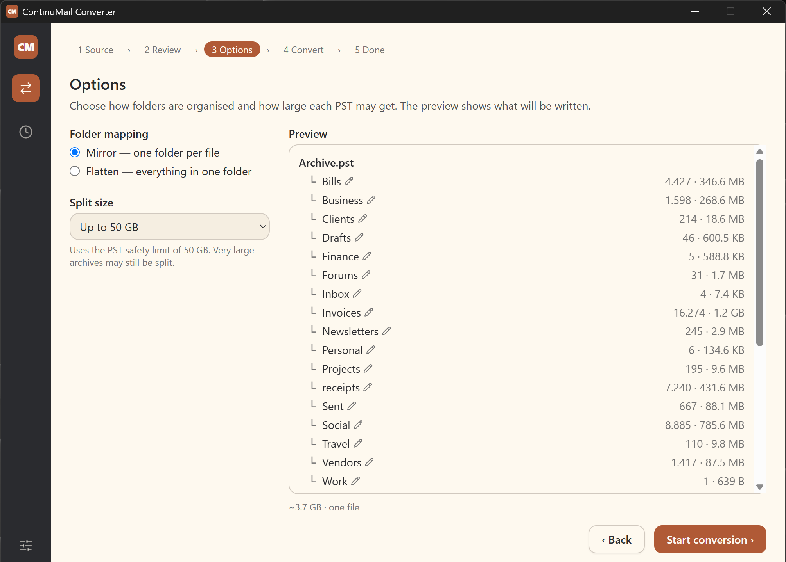

# ContinuMail Converter

**Convert Thunderbird profiles and mbox mail archives — Gmail Takeout, exported Local Folders, old POP stores — into Outlook PST files, locally, with no upload and no Outlook installation required.**

[](LICENSE)
[](../../releases/latest)
[](#-download--install)
[](#-download--install)
[](https://www.continumail.com/)

<p align="center">
  
</p>

## ✨ Highlights

- **No Outlook, no COM automation.** Writes `.pst` directly with a from-scratch PST engine — nothing to install, nothing hijacked.
- **Private & local-first.** Reads your archive on disk, makes **no network connections**, uploads nothing. Originals are only ever read.
- **Thunderbird-first, mbox-everywhere.** Converts a whole **Thunderbird profile** — folder tree plus `.msf` flag/tag fidelity — or any **mbox** archive: Gmail Takeout, exported Local Folders, old POP stores. Built and validated against real exports, including a MimeKit mbox bug that truncates some archives (worked around here).
- **Faithful.** Preserves folder structure (including nested Thunderbird folders), attachments (inline images + embedded `.eml`), HTML bodies, dates, To/Cc/Bcc, importance, and threading headers — and, from a live **Thunderbird profile**, recovers read/unread, replied/forwarded/starred flags, junk, and tags (→ Outlook categories, with their colours on Windows).
- **Free, open, and it stays free** — GPL-3.0-or-later, part of the [ContinuMail](#-license) family of honest mail tools.

> **Early release (0.x).** Covered by a comprehensive automated test suite and validated on real Thunderbird profiles and Gmail Takeout / Exchange exports — but please keep backups and validate output before relying on it. See [`TESTING.md`](TESTING.md) for how releases are validated.

## Overview

mbox → PST is genuinely hard to get right, and most tools that do it are paid and closed-source. The maintainer is an MSP technician who hit this on migration after migration — mail stranded in old ISP mailboxes, ancient Thunderbird, POP3 — with no good free path to something modern like Microsoft 365. So this got built, and it's given away. It stands on excellent existing work (see [Credits](#-credits)); what's added is a free, open, local-first tool for the messy real-world archives that keep showing up.

Most free/open options write PST by remote-controlling a running copy of Outlook (COM automation) — Outlook must be installed and licensed, and it's locked for the entire run. ContinuMail is **100% independent of Outlook**: it writes PST directly via the vendored, genuinely from-scratch [PSTFileFormat](https://github.com/ROM-Knowledgeware/PSTFileFormat) engine. You can keep working while it runs.

## 📥 Download & install

### Desktop app (Windows 10/11)

1. Download the latest installer from the [**Releases**](../../releases/latest) page: `ContinuMail Converter_<version>_x64-setup.exe`.
2. Run it. ContinuMail installs for the current user (no admin needed) and adds a Start-menu shortcut. Windows 10/11, 64-bit.

> **"Windows protected your PC"?** This early release is **not yet code-signed**, so SmartScreen may warn about an "unknown publisher." If you trust this source, click **More info → Run anyway**. (Code signing is [on the roadmap](#-roadmap).)

### Command-line (Windows · Linux · macOS)

The converter's engine is fully cross-platform. Grab the single-file CLI for your OS from the [**Releases**](../../releases/latest) page (on Windows, the desktop installer above already includes it):

| OS | Binary |
|----|--------|
| Windows | `mail2pst-cli-<version>-win-x64.exe` |
| Linux (x64) | `mail2pst-cli-<version>-linux-x64` |
| macOS (Apple Silicon) | `mail2pst-cli-<version>-osx-arm64` |

**Linux** — the self-contained runtime needs ICU; install it once if your distro doesn't ship it (`sudo apt install -y libicu-dev` on Debian/Ubuntu), then:

```bash
chmod +x mail2pst-cli-<version>-linux-x64
./mail2pst-cli-<version>-linux-x64 scan --input mail.mbox
```

**macOS** — the binary is **unsigned**, so Gatekeeper quarantines a browser-downloaded copy. Clear the quarantine flag once (or right-click → Open the first time):

```bash
xattr -dr com.apple.quarantine ./mail2pst-cli-<version>-osx-arm64
chmod +x mail2pst-cli-<version>-osx-arm64
./mail2pst-cli-<version>-osx-arm64 scan --input mail.mbox
```

See [Command-line interface](#-command-line-interface) for the full `scan` / `convert` usage.

## 🚀 Using the app

The desktop app walks you through the whole conversion; your originals are never modified.

1. **Source** — point it at a **Thunderbird profile** (auto-discovered, or browse to one) or pick individual `.mbox` files / a folder of them.
2. **Accounts** *(multi-account profiles)* — when a profile holds more than one mail account, review them and keep or drop each; by default each account becomes its **own PST**, or combine them into one.
3. **Scanning** — a fast dry-run counts messages and estimates output size before anything is written.
4. **Review** — see per-folder counts (with an `.msf` badge where Thunderbird flag/tag data is available); choose whether to include empty folders.
5. **Options** — pick folder mapping (mirror or flatten), set a split size, preview the resulting PST tree, and (for profiles) choose junk handling and whether to skip deleted messages.
6. **Convert** — watch live progress (count, MB/s, ETA); cancel any time.
7. **Done** — open the output folder, review any warnings, see what Thunderbird state was applied, and (Windows + Outlook) optionally **import your Thunderbird tag colours** into Outlook so the new categories match.

## 🎯 Features

- **mbox input** via a custom mbox splitter plus MimeKit entity parsing (robust to the Gmail Takeout / MimeKit EOF quirk).
- **Thunderbird profile mode:** point the app (or `convert --profile`) at a Thunderbird profile and it auto-discovers the nested folder tree and pairs each mbox with its `.msf` for full flag/tag fidelity.
- **Multi-account:** a profile with several mail accounts produces **one PST per account** by default (each account a top-level folder), or combine them into a single PST.
- **Category colours (Windows + Outlook):** optionally import your Thunderbird tag colours into Outlook's category master list so the new categories match — one click on the Done screen, or the `import-colours` CLI command.
- **Junk & expunged handling:** route Thunderbird-scored junk (leave / tag as a "Junk" category / move to a Junk Email folder), and optionally drop messages Thunderbird marked deleted.
- **Folder mapping:** mirror (one PST folder per source file), flatten, or per-source custom target folder. Empty source folders can be kept as empty PST folders.
- **Size-based splitting:** one PST per output group, auto-split into `Name-1.pst`, `Name-2.pst`, … when a size cap is exceeded (a single un-split output is just `Name.pst`).
- **HTML bodies** (`PidTagHtml` + `PidTagNativeBody`) with an always-present plain-text fallback.
- **Full attachments:** regular files, inline CID images (correctly hidden, so no phantom paperclip), and embedded `.eml` messages.
- **Metadata fidelity:** To/Cc/Bcc recipient types, importance/priority, Message-ID / In-Reply-To / References, conversation topic. Bcc recipients are preserved with their MAPI Bcc type and appear in Outlook's Bcc field (this is a faithful archive of mail you already sent — nothing to hide in a local store).
- **Thunderbird flag & tag fidelity:** from a **live Thunderbird profile**, the converter reads each folder's `.msf` index to recover **read/unread, replied, forwarded, starred** (→ Outlook follow-up flag), **junk**, and **tags** — and turns tags into Outlook **categories** using your real tag names. (Without a profile, these are recovered only from inline `X-Mozilla-Status` flags where present — see [Limitations](#-limitations).)
- **Memory-friendly:** large attachments (≥ 4 MB) spill to a temp file so many don't pile up in memory at once.
- **Conversion reports** (human-readable + JSON) listing skipped messages and warnings.

## ⚠️ Limitations

- **Non-UTF-8 / UTF-16 mbox envelopes.** The mbox envelope and headers are read as UTF-8/ASCII; archives whose *envelope framing* uses other encodings may not parse cleanly. (Message **bodies** honour their own MIME charset — this caveat is about the mbox framing, not body text.)
- **Plain-text body is a best-effort fallback.** Real HTML is preserved faithfully (`PidTagHtml`) and is what Outlook displays; the generated plain-text alternative is a lightweight stripper, not a full renderer.
- **Thunderbird flag/tag recovery needs a live profile.** Thunderbird stores per-message flag state in its `.msf` index, not the mbox. Point the converter at a **live profile** (the app's profile mode, or `convert --profile`) and it reads the `.msf` to recover read/unread, replied, forwarded, starred (→ follow-up flag), junk, and tags (→ Outlook categories) — including for IMAP/EWS accounts. A **standalone exported `.mbox`** with no adjacent `.msf` can't carry that: there, only inline `X-Mozilla-Status` flags (read/replied/forwarded/starred, typical of POP / older Local Folders stores) are recoverable, and tags/junk are not.
- **Category *colours* need Outlook (Windows).** The conversion needs no Outlook, but matching Outlook's category colours to your Thunderbird tags is done by `import-colours` (one click on Done, or the CLI), which edits Outlook's master category list via COM and so requires Outlook installed and **closed**.

## ⌨️ Command-line interface

The same engine ships as a CLI (the desktop app bundles and drives it) — useful for automation and large batch jobs. It uses subcommands:

```bash
# Dry-run: per-source breakdown (counts, sizes, date range), writing nothing.
dotnet run --project src/Mail2Pst.Cli -- scan --input <path.mbox> [--input <path2.mbox> ...]

# Discover: walk a Thunderbird mail directory and emit a nested source list (no parsing).
dotnet run --project src/Mail2Pst.Cli -- discover --input <mail-dir>

# Convert: JSON Lines progress to stdout, PST + reports to the output directory.
dotnet run --project src/Mail2Pst.Cli -- convert --config <config.json> --output <output-dir>

# Convert a whole Thunderbird profile: discovers folders, pairs each mbox with its .msf,
# and applies flag/tag/junk enrichment (optional --config tunes mapping/junk/split).
dotnet run --project src/Mail2Pst.Cli -- convert --profile <thunderbird-profile-dir> --output <output-dir>

# Import Thunderbird tag colours into Outlook's category list (Windows; Outlook must be closed).
# Preview with --profile; write with --apply (or apply a saved plan with --plan-file).
dotnet run --project src/Mail2Pst.Cli -- import-colours --profile <thunderbird-profile-dir> [--apply]
```

A minimal working example lives in `fixtures/sample-config.json` + `fixtures/sample.mbox`. Send `cancel` on the process's **stdin** (or `SIGTERM` / `Ctrl+C`) to stop a running `convert` cleanly. Exit codes: **0** success, **1** fatal error, **2** cancelled.

### 🗂️ Thunderbird subfolders (`discover`)

Point `discover` at a Thunderbird mail directory — a file `Inbox` sitting beside a sibling `Inbox.sbd/` that holds its subfolders — and it reconstructs the nested tree, emitting one source per folder with a nested `targetFolderPath` (parse-free and fast). Feed those into a `convert` config and the resulting PST preserves the folder hierarchy, including parent folders that have both their own mail and subfolders. A plain directory of `.mbox` files is handled too (each becomes a top-level folder).

> The **desktop app exposes this directly** via its Thunderbird **profile mode** (Source → *Thunderbird profile*), which runs `discover` under the hood and adds `.msf` flag/tag enrichment and multi-account handling. `discover` remains available on its own for scripting and for pointing at a bare mail directory (a plain folder of `.mbox` files also works in both the app and the CLI).

<details>
<summary><b>Configuration, scan output, and JSON Lines reference</b></summary>

A config describes one or more output groups (each becomes a PST file group):

```json
{
  "outputs": [
    {
      "name": "Personal",
      "maxSizeMB": 45000,
      "folderMapping": "mirror",
      "includeEmptyFolders": true,
      "sources": [
        { "path": "Takeout/Mail/Inbox.mbox", "type": "mbox" }
      ]
    }
  ]
}
```

- `folderMapping`: `mirror` (one PST folder per source file, named after it) or `flatten` (everything into one folder unless a source sets `targetFolder`).
- `maxSizeMB`: split into `Name-1.pst`, `Name-2.pst`, … when exceeded; a single un-split output is just `Name.pst`.
- `includeEmptyFolders`: keep empty source folders as empty PST folders.
- `targetFolderPath` (per source): an array — e.g. `["Inbox", "Archive", "2024"]` — placing that source's mail into a **nested** PST folder; the engine creates the whole path on demand. `targetFolder` (string) is single-segment shorthand for the same thing. Set one or the other, not both. `discover` fills these in for you from a Thunderbird `.sbd` tree.

**`scan`** prints a single pretty-printed JSON object with run-wide `totals` and a per-source breakdown. `bytes` is the estimated PST content size; `sourceBytes` is the raw mbox size; `dateFrom`/`dateTo` are `null` when a source has no dated messages.

```json
{
  "type": "scan",
  "totals": { "messages": 17989, "bytes": 2007117000, "sourceBytes": 2400000000, "sources": 2 },
  "sources": [
    { "id": "inbox", "path": "Takeout/Mail/Inbox.mbox", "displayName": "Inbox",
      "messages": 12000, "bytes": 98765432, "sourceBytes": 123456789,
      "dateFrom": "2012-01-01T00:00:00Z", "dateTo": "2024-12-31T00:00:00Z",
      "warnings": 0, "skipped": 0 }
  ],
  "skipped": [],
  "warnings": []
}
```

**`discover`** prints a single JSON object describing the reconstructed tree — one `sources[]` entry per mail file with its nested `targetFolderPath` (ready to drop into a `convert` config). Folder-name issues surface as `warnings[]`; index/metadata files (`.msf`) are summarised in `skipped[]`.

```json
{
  "type": "discovery",
  "root": "C:/.../Mail/Local Folders",
  "layout": "thunderbird",
  "sources": [
    { "path": ".../Inbox", "type": "mbox", "targetFolderPath": ["Inbox"], "displayName": "Inbox", "sourceBytes": 85924142 },
    { "path": ".../Inbox.sbd/Archive", "type": "mbox", "targetFolderPath": ["Inbox", "Archive"], "displayName": "Archive", "sourceBytes": 1245184 }
  ],
  "warnings": [],
  "skipped": []
}
```

**`convert`** streams one JSON object per line on stdout, ending with exactly one terminal event (`done`, `error`, or `cancelled`):

```json
{"type":"started","input":"config.json","outputDirectory":"out/"}
{"type":"scan","totalMessages":17989}
{"type":"progress","converted":1000,"total":17989,"warnings":2,"skipped":0,"currentSource":"Inbox.mbox","currentFolder":"Inbox"}
{"type":"warning","source":"Inbox.mbox","identifier":"message #52","reason":"Dropped attachment 'bad.bin': invalid encoding"}
{"type":"done","converted":17989,"skipped":0,"warnings":1,"outputs":["out/Personal.pst"],"outputDirectory":"out/","report":"out/conversion-report.json","elapsedMs":132000}
```

The output directory also gets `conversion-report.txt` (human-readable) and `conversion-report.json` (same data, machine-readable).

</details>

## 🔧 Build from source

**Engine + CLI** — requires the [.NET 8 SDK](https://dotnet.microsoft.com/download). Windows is the primary target (the PST engine uses some Windows APIs).

```bash
dotnet build Mail2Pst.sln
dotnet test  Mail2Pst.sln
```

**Desktop app** — a [Tauri](https://tauri.app/) v2 + React (Vite) app that bundles the CLI as a sidecar and drives it via the JSON Lines contract above; produces an NSIS installer for Windows 10/11.

Prerequisites: [Node.js](https://nodejs.org/) (LTS) + npm, the [Rust toolchain](https://rustup.rs/) with the MSVC target (`rustup target add x86_64-pc-windows-msvc`), the [.NET 8 SDK](https://dotnet.microsoft.com/download) (for the sidecar), and WebView2 (present on Windows 11; the installer ensures it on Windows 10).

```bash
cd desktop
npm install
npm run tauri dev     # run the app in dev mode
npm test              # frontend unit tests (Vitest)
npm run tauri build   # release build + NSIS installer
```

> The **CLI engine builds and publishes on Windows, Linux, and macOS** — e.g. `dotnet publish src/Mail2Pst.Cli -c Release -r <rid> --self-contained` (`win-x64` / `linux-x64` / `osx-arm64`). Only the **desktop GUI** is Windows-only for now; its sidecar build (`npm run sidecar`) targets `win-x64` and runs automatically before `tauri dev`/`build`.

## 🔒 Privacy & disclaimer

ContinuMail Converter reads your archive locally and writes the PST locally. It makes **no network connections** and **uploads nothing**; your originals are only ever read, never modified. See [`SECURITY.md`](SECURITY.md) for the app's security posture and Content Security Policy.

It is free software, provided **"as is", without warranty of any kind** (see [`LICENSE`](LICENSE)). Email history matters, so please **keep a backup** of your originals, **validate** the output (open the PST, or import into a test Outlook profile), and **review the conversion report** before relying on converted data. The installer is not yet code-signed (see [Download & install](#-download--install)).

## 🗺️ Roadmap

ContinuMail Converter aims to be a genuinely **free, open alternative to the paid, closed email-conversion products** that dominate this space. mbox came first on purpose — in the field it's both the most common archive and the hardest to convert faithfully. Next up:

- **More formats** — EML and MSG input next (mbox-only today).
- **Code signing** of the installer (to remove the SmartScreen prompt).
- **Cross-platform desktop app** — the command-line converter already runs on Windows, Linux, and macOS; bringing the desktop GUI to Linux/macOS (packaging + signing) is next.

The converter is free and open-source and stays that way. (ContinuMail follows an open-core model: this converter is free forever; any paid products are separate.)

## 🤝 Contributing & feedback

Found a bug, a quirky archive, or want a feature? [**Open an issue**](../../issues). Contributions are welcome under a lightweight CLA — see [`CONTRIBUTING.md`](CONTRIBUTING.md). To report a security issue privately, see [`SECURITY.md`](SECURITY.md).

**📚 Further reading:** [`TESTING.md`](TESTING.md) (how it's validated) · [`TEMPLATE-PROVENANCE.md`](TEMPLATE-PROVENANCE.md) (the bundled PST template) · [`SECURITY.md`](SECURITY.md) · [`TRADEMARKS.md`](TRADEMARKS.md) · [How it works](#-how-it-works-for-contributors).

## 📄 License

ContinuMail Converter's own code is licensed under the **GNU General Public License v3.0 or later** (**GPL-3.0-or-later**) — see [`LICENSE`](LICENSE). It bundles third-party components under their own GPL-compatible licenses (see [`NOTICE`](NOTICE)):

- **PSTFileFormat** (the MS-PST read/write engine) under **LGPLv3** — vendored under `vendor/PSTFileFormat/` with local modifications; the complete corresponding source is included, so it can be modified and the app rebuilt.
- **MimeKit** under the **MIT License**.

The **ContinuMail** name, logos, icons, and brand assets are **not** covered by the GPL and remain proprietary — see [`TRADEMARKS.md`](TRADEMARKS.md).

## 🙏 Credits

- **[ROM-Knowledgeware/PSTFileFormat](https://github.com/ROM-Knowledgeware/PSTFileFormat)** by **Tal Aloni** — the rare, from-scratch MS-PST reader/writer that makes ContinuMail's Outlook-independence possible. **ContinuMail would not exist without it.** (Vendored, with local modifications, per the LGPL.)
- **[MimeKit](https://github.com/jstedfast/MimeKit)** by **Jeffrey Stedfast** — the MIME parsing that reads every message.
- **[knk106/MorkReader](https://github.com/knk106/MorkReader)** — a clear, public-domain reference implementation that helped us understand Thunderbird's undocumented Mork `.msf` format. ContinuMail's Mork reader is project-native code (not forked or vendored), but knk106's work was a valuable map of the territory — thank you.

## 🧑‍💻 How it works (for contributors)

Writing PST files is the hard part: `libpst`/`java-libpst` are read-only, and most "mbox to PST" tools drive Outlook via COM. PSTFileFormat is a real from-scratch writer. ContinuMail calls `PSTFile.CreateEmptyStore()` to create each output PST from scratch — no pre-seeded template is needed or shipped.

Key things to know when working on the code:

- `MboxParser` does **not** use MimeKit's `MimeFormat.Mbox` parser — it splits the file into per-message chunks (mboxrd convention) and parses each as a MIME entity, working around a MimeKit bug that truncates some real archives.
- Use `parentFolder.CreateChildFolder(name, type)` (not `CreateNewFolder()`), and call `folder.SaveChanges()` before `file.EndSavingChanges()`.
- The vendored allocation scan was made O(1) (AMap cache + free-space index) to keep large PST writes fast.

**Layout:** `src/Mail2Pst.Core/` (engine), `src/Mail2Pst.Cli/` (CLI), `desktop/` (Tauri + React app), `tests/Mail2Pst.Core.Tests/` (xUnit), `vendor/PSTFileFormat/` (vendored, LGPLv3).
